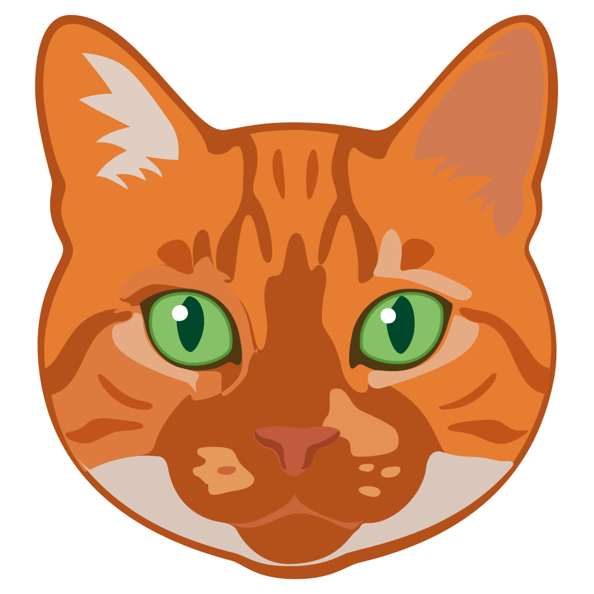

<p align="center">
  
</p>

<h1 align="center">Catch</h1>

<p align="center">
  <strong>the cat-tracking app for people who are normal about cats</strong>
</p>

<p align="center">
  
  
  
  
</p>

---

## what is this

Catch is an iOS app for logging every cat you encounter in the wild. Register cats, track sightings, pin them on a map, collect breeds like they're Pokemon, and follow your friends to see their cat discoveries too.

Themed around **Steven** — an orange tabby with a permanent look of mild disapproval.

## features

### Cat Registration & Encounter Logging
Register cats you find with photos, breed, estimated age, and location. When you spot them again, log a repeat encounter to build a sighting history. Each cat gets a profile page with its full encounter timeline.

### AI Breed Detection
Snap a photo and Catch identifies the breed using an on-device **CoreML model** powered by Apple's **Vision framework**.

**How it works:**
1. Photos are processed through a `VNCoreMLRequest` using a custom-trained `catBreedDetection` model
2. The model returns confidence scores across **37 recognized breeds**
3. Results above a 5% confidence threshold are mapped to display names via `BreedLabelMapper`
4. The top 3 predictions are surfaced as suggestions with confidence badges
5. All inference runs **on-device** — no photos leave the phone

The breed classifier is protocol-driven (`BreedClassifierService`) so it's fully mockable in tests. A separate `CatPhotoValidationService` uses Vision to confirm an image actually contains a cat before accepting it.

### Breed Collection
A Pokedex-style tracker for cat breeds. Every breed you encounter gets logged to your collection with rarity tiers. Browse the full catalog, filter by discovered vs. undiscovered, and track your progress toward catching them all.

### Interactive Map with Clustering
All your cat sightings plotted on a live map with smart clustering:

- **UIKit `MKMapView`** wrapped in SwiftUI (the native SwiftUI `Map` doesn't support clustering)
- **Automatic clustering** groups nearby pins at zoom levels
- **Spiderfy** — when zoomed in tight (`latitudeDelta < 0.005`), overlapping pins fan out into a circle pattern (up to 9, sorted by encounter count) with a "+N" overflow bubble
- **Snapshot-based diffing** avoids unnecessary annotation rebuilds — only updates when cat data actually changes
- Date range and follow filters to slice the map view

### Social
Follow friends, see their cat discoveries in your feed, and interact with encounters:

- **Follow system** with approval-based privacy for private accounts
- **Social feed** merging your own + followed users' encounters, sorted chronologically with infinite scroll
- **Likes & comments** on individual encounters
- **User discovery** with search and suggested people based on shared breed discoveries
- **Public & private profiles** — own profile with diary/collection/breed tabs, remote profiles with follow controls

### Real-time Sync
All data syncs through **Supabase** with real-time subscriptions for follows, likes, and comments. No offline mode — the network is the source of truth.

## architecture

```
┌─────────────────────────────────────────────────────┐
│  SwiftUI Views                                      │
│  (Feed, Map, Profile, AddCat, Social, BreedLog)     │
├─────────────────────────────────────────────────────┤
│  Services (protocols)                               │
│  BreedClassifier · Social · Follow · Feed · Sync    │
├─────────────────────────────────────────────────────┤
│  Repositories (protocols)                           │
│  CatRepo · EncounterRepo · FollowRepo · SocialRepo  │
├─────────────────────────────────────────────────────┤
│  Infrastructure                                     │
│  Supabase · Vision/CoreML · MapKit · CoreLocation   │
└─────────────────────────────────────────────────────┘
```

The project is split into two targets:

- **`CatchCore`** — a Swift package (`Sources/CatchCore/`) containing all pure-logic code: protocols, domain models, mappers, validators, and service interfaces. No UIKit/SwiftUI dependencies.
- **`catch`** — the main iOS app target with SwiftUI views, platform-specific service implementations (Vision, Sign in with Apple), and Supabase infrastructure.

### Key design decisions

| Pattern | Why |
|---|---|
| **Protocol-driven services** | Every service has a protocol. Views depend on abstractions, not implementations. Makes testing trivial. |
| **Service → Repository → Infrastructure** | Clear layering. Views call services, services call repos, repos talk to Supabase. No shortcuts. |
| **`@Observable` services via `@Environment`** | Services are injected into the SwiftUI environment. State flows up, actions flow down. |
| **Three-layer image cache** | L1 memory (75 MB `NSCache`) → L2 disk (150 MB LRU) → L3 network. Deduplicates in-flight requests. All remote images go through `RemoteImageCache` — no raw `URLSession` fetches. |
| **Snapshot-based map diffing** | `PinSnapshot` structs compared in `updateUIView` to skip redundant MKMapView annotation rebuilds. |
| **Centralized string constants** | All user-facing copy lives in `CatchStrings` with `String(localized:)` for i18n readiness. |

## tech stack

| Layer | Technology |
|---|---|
| UI | SwiftUI |
| Navigation | Coordinator pattern |
| Backend | Supabase (Postgres + Auth + Storage + Realtime) |
| Auth | Sign in with Apple |
| ML | Vision + CoreML (on-device breed classification & photo validation) |
| Maps | MapKit (UIKit `MKMapView` via `UIViewRepresentable`) |
| Location | CoreLocation (GPS + reverse geocoding) |
| Photos | PhotosUI (multi-image picker, JPEG 0.7 compression) |
| Image caching | Custom 3-layer cache (memory → disk → network) |
| Package management | Swift Package Manager |
| Database migrations | Supabase CLI |

## project structure

```
├── Package.swift                    # CatchCore Swift package
├── Makefile                         # Build & test automation
├── Sources/CatchCore/               # Shared pure-logic package
│   ├── Models/                      # Domain models, Location, CatBreed
│   ├── Services/                    # Protocol definitions + shared logic
│   │   ├── BreedClassifier/         # Breed prediction protocol & mapper
│   │   ├── CatPhotoValidation/      # Cat-in-photo validation protocol
│   │   ├── CloudSync/               # Sync repos, payloads, mappers
│   │   ├── Follow/                  # Follow system protocol & models
│   │   ├── Social/                  # Like/comment service & models
│   │   └── UserBrowse/              # User discovery protocol
│   └── Theme/                       # CatchStrings (shared constants)
├── catch/                           # Main iOS app target
│   ├── Views/                       # All SwiftUI views by feature
│   ├── Components/                  # Reusable UI components
│   ├── Services/                    # Platform-specific implementations
│   │   ├── BreedClassifier/         # VisionBreedClassifierService
│   │   ├── CatPhotoValidation/      # VisionCatPhotoValidationService
│   │   ├── CloudSync/               # Supabase repo implementations
│   │   └── SocialFeed/              # Feed aggregation service
│   ├── Models/                      # App models + display models
│   └── Theme/                       # CatchTheme + string extensions
├── Tests/CatchCoreTests/            # Pure-logic tests (no simulator)
├── catchTests/                      # SwiftData tests (simulator required)
└── supabase/migrations/             # Database migration SQL files
```

## building

**Requirements:** Xcode 15+, iOS 17+ deployment target

```bash
# Clone
git clone https://github.com/graysonmartin/catch.git
cd catch

# Open in Xcode
open catch.xcodeproj
```

The app target depends on the local `CatchCore` Swift package — Xcode resolves it automatically.

## testing

```bash
# Pure-logic tests (fast, no simulator)
make test-fast

# SwiftData tests (requires iOS simulator)
make test

# Both targets
make test-all
```

## license

All rights reserved.
